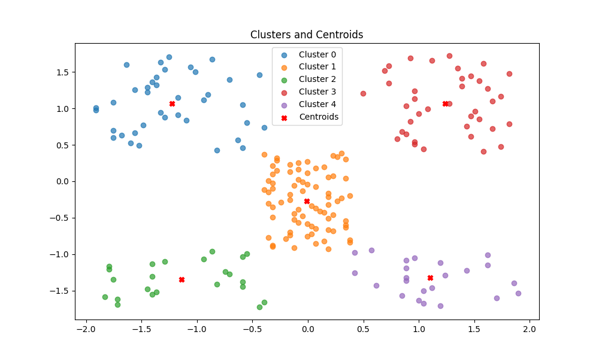
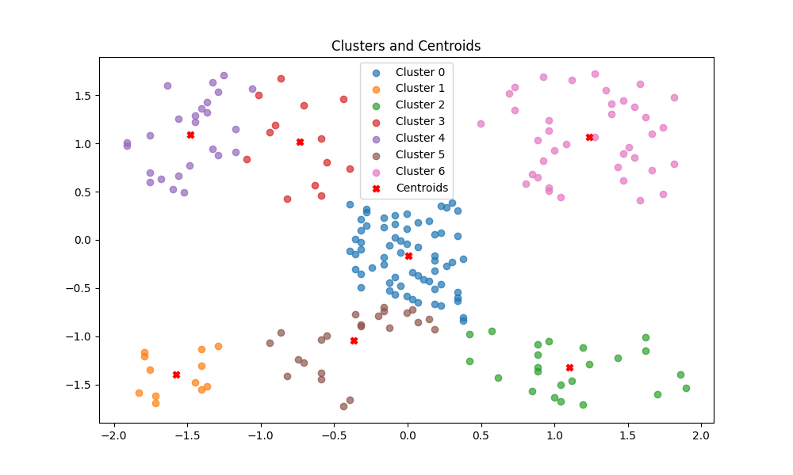

# K-Means Clustering Algorithm for Customers at a Retail Stores
This K-means clustering algorithm is designed to group customers of a retail store based on their purchase history only. It's the second task submitted for the Prodigy InfoTech Company as one of their Machine Leaning Inters.

## Runtime Output

### Selecting Number of Clusters
After multiple trials and errors it was found that the most suitable number of clusters (<b><i>K</i></b>) was <b><i>5</i></b>

#### k=1 
#### k=3 
#### k=5 
#### k=7 
#### k=9 
